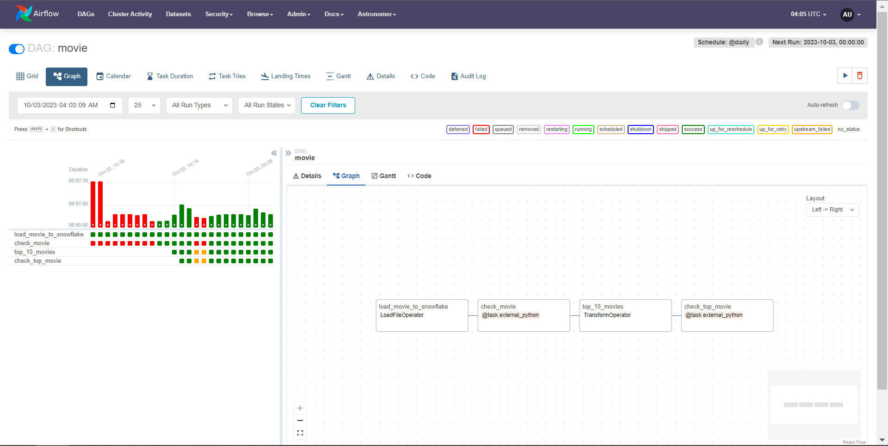

# Data Pipeline Management with Airflow, Soda, and Snowflake
This project is designed to provide practical experience with Airflow for workflow management, Soda for data quality checks, and Snowflake for secure and efficient data storage.

### Table of contents

* [Architecture diagram](#architecture-diagram)
* [Overview](#overview)
* [Running project](#running-project)
* [Tools and technologies](#toolntech)
* [Project Content](#project-content)
* [Prerequisites](#prerequisites)
* [Contact](#contact)

## Architecture diagram

## Overview
* In this project, we ingest data from HTTP to Snowflake, subsequently utilizing Soda for data quality checks. Following this, we extract the top 10 movies and perform another round of quality checks using Soda.

<!-- RUNNING PROJECT -->
## Running project
1. Start Airflow on your local machine by running 'astro dev start'.

This command will spin up 4 Docker containers on your machine, each for a different Airflow component:

- Postgres: Airflow's Metadata Database
- Webserver: The Airflow component responsible for rendering the Airflow UI
- Scheduler: The Airflow component responsible for monitoring and triggering tasks
- Triggerer: The Airflow component responsible for triggering deferred tasks

2. Verify that all 4 Docker containers were created by running 'docker ps'.

Note: Running 'astro dev start' will start your project with the Airflow Webserver exposed at port 8080 and Postgres exposed at port 5432. If you already have either of those ports allocated, you can either [stop your existing Docker containers or change the port](https://docs.astronomer.io/astro/test-and-troubleshoot-locally#ports-are-not-available).

3. Access the Airflow UI for your local Airflow project. To do so, go to http://localhost:8080/ and log in with 'admin' for both your Username and Password.

You should also be able to access your Postgres Database at 'localhost:5432/postgres'.

## Tools and Technologies

The project integrates the following tools and technologies:

1. **Snowflake:** A cloud-based data warehouse tool that offers organizations a flexible and scalable storage system.

2. **Soda:** A data quality framework and toolset for automating data quality checks.

3. **Astro CLI:** A command-line interface for simplifying Apache Airflow setup and management.

4. **Visual Studio Code:** A versatile code editor.

5. **Docker:** A platform for packaging and distributing applications as containers.

6. **Git Version Control:** A distributed version control system for tracking changes in source code.

<!-- PREREQUISITES -->
## Prerequisites
What you need to run the project:
- [Docker](https://azure.microsoft.com/en-us/) Hightly recommend v4.22.1 or above
- The Astro CLI is a command-line interface for data orchestration. It allows you to get started with Apache Airflow quickly and it can be used with all Astronomer products.
- Astro SDK allows rapid and clean development of {Extract, Load, Transform} workflows using Python and SQL, powered by Apache Airflow.
- Soda Core is an open source framework for checking data quality. It uses the Soda Checks Language (SodaCL) to run checks defined in a YAML file. Soda Core lets you: Define checks as YAML configuration, including many preset checks.

## Project Contents
- Docker: There 4 containers which have airflow's services

- Airflow Webserver: 

- The DAG we create;

Your Astro project contains the following files and folders:

- dags: This folder contains the Python files for your Airflow DAGs. By default, this directory includes two example DAGs:
    - `example_dag_basic`: This DAG shows a simple ETL data pipeline example with three TaskFlow API tasks that run daily.
    - `example_dag_advanced`: This advanced DAG showcases a variety of Airflow features like branching, Jinja templates, task groups and several Airflow operators.
- Dockerfile: This file contains a versioned Astro Runtime Docker image that provides a differentiated Airflow experience. If you want to execute other commands or overrides at runtime, specify them here.
- include: This folder contains any additional files that you want to include as part of your project. It is empty by default.
- packages.txt: Install OS-level packages needed for your project by adding them to this file. It is empty by default.
- requirements.txt: Install Python packages needed for your project by adding them to this file. It is empty by default.
- plugins: Add custom or community plugins for your project to this file. It is empty by default.
- airflow_settings.yaml: Use this local-only file to specify Airflow Connections, Variables, and Pools instead of entering them in the Airflow UI as you develop DAGs in this project.

<!-- CONTACT -->
## Contact
Please feel free to contact me if you have any questions.

